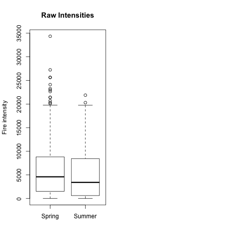

# Carbon Dynamics

## About this model

### Data acquisition

### Data preparation

You must run the data_prepare.R script, like so:

    # cd to this projects directory
    $  cd /path/to/CarbonDynamics
    $ R < data_prepare.R

The script will merge, etc. and create 6 Rdata files with the data
prepared for running the model.

Also these plots are generated:

### Run model

    $ R < simulation_experiments.R