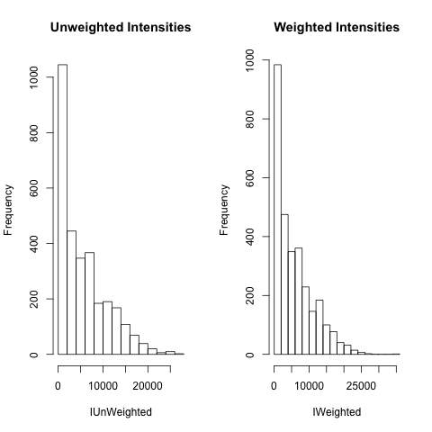
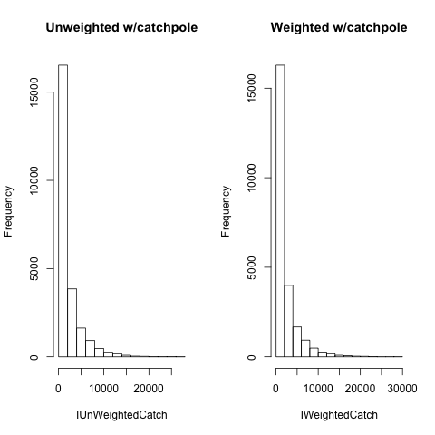

# Carbon Dynamics

## About this model

Hybrid model that simulates forest carbon dynamics. It is composed of three modules that interact dynamically: stand dynamics, carbon dynamics and fire severity. It operates at the scale of 1.0 ha. It calculates and tracks carbon stocks in nine above- and belowground pools and estimates carbon fluxes.

### Data acquisition

The inventory plot data belongs to the Québec Ministry (Ministère des Forêts, de la Faune et des Parcs), and it is not transferable. Data was made available for research purposes through the Université Laval library (http://geoindex-plus.bibl.ulaval.ca/), under the agreement held between the government and the university. Inventory plot data is available on request by contacting the forest inventory division of the ministry (http://www.mffp.gouv.qc.ca/forets/inventaire/). All interested researchers can access the data in the same way the authors did. The authors confirm that the historical fire data underlying the findings can be obtained from Figshare: http://figshare.com/account/projects/5641.

### Data preparation

You must run the data_prepare.R script, like so:

    # cd to this projects directory
    $  cd /path/to/CarbonDynamics
    $ R < data_prepare.R

The script loads the inventory plot and fire data and preprocess it to create data input for the C dynamics model. It generates 3 Rdata files : Tree_list.Rdata contains the monospecific black spruce diamater-class data; spring_weighted_catch.Rdata and summer_weighted_catch.Rdata contain spring and summer head fire intensities, respectively, after accounting for fire size and variation in intensity within fire perimeter.  
prepared for running the model.

Also these plots are generated:

### Run model
    $ R < utils.R
    $ R < carbon_dynamics.R
    $ R < simulation_experiments.R
    
To run the model first load utils.R which contains all implemented functions. Then load carbon_dynamics.R with the main model code. Finally, in simulation_experiments.R, define the number of model iterations and the fire regime parameters of interest, run the model and save the output data into R objects.
